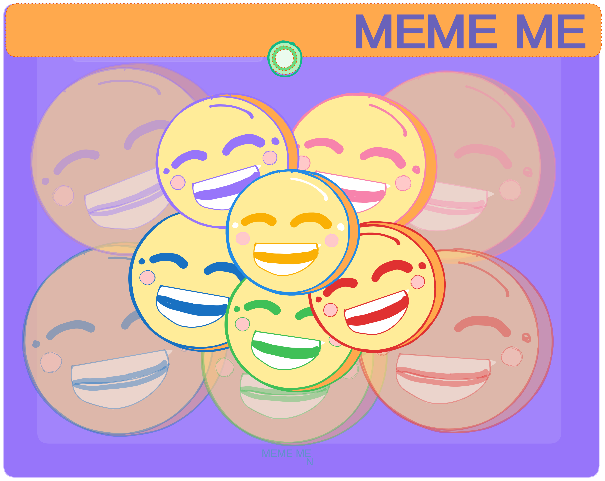

<div align="center">
    
</div>

# Meme Me — Face Meme Matcher 🎭😆 

> Don't just send memes — **become** the meme.

Meme Me uses your webcam and AI to match your live facial expressions to iconic internet memes in real time. Strike a pose, get matched, download your moment.

---

## What You Need Before Starting

- [Python](https://python.org/downloads) — check **"Add Python to PATH"** during install
- [Git](https://git-scm.com/downloads)
- A Google account (to set up Firebase)

---

## Getting Started

Setup (5 steps) exlcuding fire base set up for ServiceAccount.js Key.


**1. Clone the repo**
```bash
git clone https://github.com/BradleyWPL/face-meme-matcher.git
cd face-meme-matcher/backend
```

**2. Create and activate virtual environment**
```bash
python -m venv venv
source venv/Scripts/activate        # Windows (Git Bash)
source venv/bin/activate            # Mac/Linux
```

**3. Install dependencies**
```bash
pip install -r requirements.txt
```

**4. Add your Firebase credentials**
- Go to [Firebase Console](https://console.firebase.google.com)
- Create a project → Project Settings → Service Accounts → Generate new private key
- Save the file as `serviceAccountKey.json` inside the `backend/` folder

---------------------------------------------------------------------------------------------------------------------------------------------------

## 🔥 Firebase Setup (Required)

### 1. Create your Firebase project
- Go to [console.firebase.google.com](https://console.firebase.google.com)
- Create a new project → enable **Firestore**, **Storage**, and **Authentication**
- Under Authentication → Sign-in method → enable **Email/Password**

### 2. Get your serviceAccountKey.json
- Project Settings → Service Accounts → **Generate new private key**
- Save the file as `serviceAccountKey.json` inside the `backend/` folder
- ⚠️ Never commit this file,  it's already ignored in `.gitignore`

### 3. Set your Firestore Rules

Go to **Firestore → Rules** and paste this:

```
rules_version = '2';
service cloud.firestore {
  match /databases/{database}/documents {
    match /users/{userId}/memeHistory/{memeId} {
      allow read, write: if request.auth != null && request.auth.uid == userId;
    }
    match /users/{userId} {
      allow read, write: if request.auth != null && request.auth.uid == userId;
    }
  }
}
```

### 4. Set your Storage Rules
Go to **Storage → Rules** and paste this:

```
rules_version = '2';
service firebase.storage {
  match /b/{bucket}/o {
    match /{allPaths=**} {
      allow read, write: if request.auth != null;
    }
  }
}
```
----------------------------------------------------------------------------------------------------------------------------------------------


**5. Run it**
```bash
python app.py
```

Then open your browser and go to:

http://localhost:5001


---

## How To Use It

1. Create an account
2. Allow camera access when prompted
3. Make a face, the app will match you to a meme!
4. Hit **Download Match** to save your moment
5. Check **Meme History** to see all your past matches

---

## Memes You Can Match

| Pose | Meme |
|------|------|
| Open mouth wide | Cat Smile 🐱 |
| Squint + pucker lips | Squint Pucker Guy |
| Wide eyes, mouth covered | Scared Guy 😱 |
| Tilt head left | Confused Dog 🐶 |
| Tilt head right | Thinking Guy 🤔 |
| Big open mouth | Reading Meme |

---

## ⚠️ One Important Note

`serviceAccountKey.json` is **not included** in this repo for security reasons.
You must generate your own from Firebase (Step 4 above). It takes 2 minutes.

---

## Tools

- [Python](https://python.org/downloads) 
- [Javascript](https://developer.mozilla.org/en-US/docs/Web/JavaScript) 
- [Git](https://git-scm.com/downloads)
- [Firebase/Firstore](https://firebase.google.com/)


--- 

##### Made with joy from **Particularly Kool Joy Coders** 😎

CSIS 3750 — Software Engineering